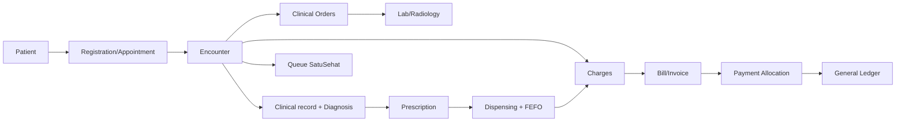

# Arsitektur

Laravel 13 tetap menjadi modular monolith dengan MySQL relational, Blade/Bootstrap, database queue, dan service layer.

Encounter, charge, stock movement, payment allocation, journal source, dan audit event adalah sumber ketertelusuran. Modul lama dipertahankan; kolom FK nullable menghindari pemutusan data historis.
