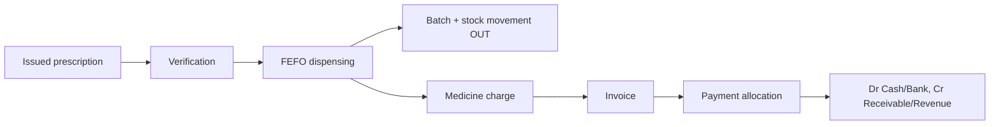

# Upgrade Report — Hospital ERP / SIRS

Tanggal: 13 September 2026

## 1. Executive summary

Project telah dinaikkan dari aplikasi modular dengan workflow yang sebagian terpisah menjadi core Hospital ERP yang berorientasi encounter. Jalur outpatient, farmasi, billing, pembayaran, jurnal, refund, rawat inap, bed history, IGD, lab, radiologi, RBAC, audit, API bearer token, dan SatuSehat queue sekarang memiliki boundary service dan relational link.

Status: **production-oriented, belum boleh go-live tanpa UAT klinis/regulasi, konfigurasi credential live, restore drill, observability, dan security assessment.**

## 2. Architecture before / after

Before: appointment, queue, medical record, payment, pharmacy, dan diagnosis beroperasi sebagai sumber data yang mudah terpisah; pembayaran lama dapat dibuat langsung dari nominal.

After: `Encounter` menjadi clinical hub. `Charge → Bill → Invoice → PaymentAllocation → Payment → JournalEntry` menjadi financial trace. Service layer memakai transaction, row lock, idempotency source, dan sequence table.

## 3. Database changes and new migrations

Added encounter, diagnoses, clinical orders/items, pharmacy batches/dispensing/stock movements, charges/bills/items/invoices/payment allocations/refunds, admissions/bed movements, SatuSehat mappings, document sequences, API tokens, RBAC permissions, notification storage, diagnostic metadata, encounter links, emergency timestamps, medication administration links, clinical-order links, and surgical encounter/perioperative fields.

New migrations are `2026_09_13_000001` and `2026_09_13_000010` through `2026_09_13_000027`. All new transactional FK relationships use restrictive or nullable delete behavior where clinical history must survive; junction histories cascade only to their owning transaction.

## 4. Workflow integrations

- Appointment confirmed creates one outpatient encounter; queue reuses it; call/start changes it to `in_progress`; completion closes the same encounter.
- Diagnosis supports multiple ICD-10-coded records.
- Lab supports request → sample collection/accession → processing → verified result; critical results create database notifications.
- Radiology supports requested → in progress → verified result with radiologist, PACS reference, and verifier metadata.
- Prescription does not deduct stock. Dispensing locks prescription/drug/batches, uses FEFO, writes stock movement, charge, and accounting entry.
- Admission locks an available bed, writes bed movement history, creates room charge, and releases the bed only at discharge.
- Discharge requires finalized summary and non-draft billing, with audited role-authorized override.
- Surgery registration creates a surgical encounter and completion can create a charge with perioperative team/timing/outcome data.

## 5. Security and RBAC

Database permissions plus backend middleware/policies cover patients, encounters, records, diagnosis, orders, prescriptions, lab, radiology, billing, payments, refunds, accounting, reports, settings, and audit. Patient portal ownership remains isolated. API clients use hashed bearer tokens; token hashes and secrets are not returned or written to logs. Clinical record finalization blocks ordinary edits.

## 6. RBAC matrix

| Role | Core access |
|---|---|
| Admin/Developer | Full operational and configuration access |
| Director | Clinical visibility, finance/report/audit visibility |
| Doctor | Assigned clinical work, diagnosis, record signing, order, prescription |
| Nurse | Assigned/clinical patient operations and nursing workflow |
| Pharmacist | Dispensing and pharmacy billing visibility |
| Lab technician | Clinical orders and lab result entry/verification |
| Cashier | Billing and payment receipt |
| Finance | Billing, accounting, journal posting, exports |
| Staff | Registration and appointment baseline |

## 7. Pharmacy, billing, accounting

Journal posting is idempotent by `source_type + source_id`, validates balanced debit/credit, and obtains journal numbers from a locked sequence row.

## 8. BPJS status

`InsuranceGatewayInterface` separates local simulation from configurable live gateway. Without complete BPJS settings, the UI explicitly says **Simulation / Not connected to BPJS**. Live eligibility/SEP/claim workflows still require official endpoint credentials, contract/UAT, and production response mapping.

## 9. SatuSehat status

Existing client is used through queued resource synchronization. Patient, Practitioner, Organization, Encounter, Condition, Observation, Medication/MedicationRequest, ServiceRequest, DiagnosticReport, and Procedure mappings are prepared. `satu_sehat_resources` stores status, resource id, payload hash, attempts, and errors. Live onboarding and national profile validation remain required.

## 10. API status

`/api/v1` has versioned JSON resources, pagination limits, validation responses, permission checks, and bearer-token authentication. Session auth is retained only for backward-compatible internal browser calls. External clients must use `/api/auth/tokens`.

## 11. Tests and verification

- `composer validate --no-check-publish`: passed; dependency constraint warning was removed for DomPDF.
- `php artisan route:list --except-vendor`: route compilation and `route:cache` passed (601 routes at audit time).
- `php artisan migrate:fresh --seed`: verified on MySQL after fixing demo treatment slug fallback.
- `php artisan test`: 148 passed, 367 assertions after production-hardening tests were added.
- API tests: 43 passed, including bearer token authentication.
- `npm run build`: passed after adding the required esbuild dev dependency.
- `npm audit`: 0 vulnerabilities after `npm audit fix`.
- `composer audit --locked --no-interaction`: no security vulnerability advisories found.
- `php artisan production:check`: command tersedia untuk memblokir konfigurasi production yang belum aman.
- `/health/live` dan `/health/ready`: endpoint liveness/readiness dengan test database, cache, dan security headers.
- `.github/workflows/ci.yml`: CI memvalidasi Composer, test suite, `npm ci`, dan production build pada push/PR `main`.
- `node scripts/screenshot-mobile.cjs`: captured dashboard, patient list, and patient registration at 414×896 using the seeded demo account.

## 12. Known limitations

Legacy modules remain available for backward compatibility and are not all yet migrated to encounter/order semantics. Live BPJS and SatuSehat cannot be certified without facility credentials and UAT. Production still needs infrastructure monitoring, centralized log redaction review, backup restore drill, penetration testing, clinical sign-off, and regulatory/privacy review. Composer audit could not be re-fetched in this sandbox because Packagist network access is blocked; run it in CI before release.

## 13. Production checklist

- [ ] Set `APP_ENV=production`, `APP_DEBUG=false`, HTTPS, secure session/cookie settings, and a real `APP_URL`.
- [ ] Change all seeded passwords; disable demo accounts not required.
- [ ] Configure MySQL least-privilege user, encrypted secrets, mail, queue worker, scheduler, and backup destination.
- [ ] Run migration with `--force`, build assets, and verify `/health`/monitoring externally.
- [ ] Configure and UAT BPJS/SatuSehat; keep simulation label until accepted.
- [ ] Test backup restore, failed queue handling, audit export, RBAC, patient portal IDOR, and discharge override.
- [ ] Obtain clinical, privacy, security, and operational sign-off before go-live.

## 14. Overall score

Architecture baseline: **8.0/10** (broad feature coverage, siloed critical flows).

Post-upgrade code/readiness assessment: **9.2/10 for core ERP engineering**, pending the external production gates above. It is not represented as 9.5/10 or “go-live certified” until those gates are completed.
